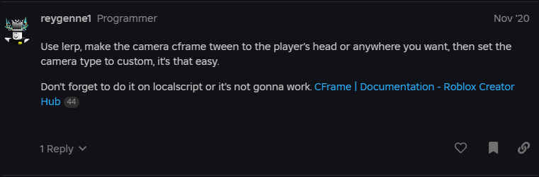

# CFrame Notes

1. [Using `CFrame.lookAt`](https://devforum.roblox.com/t/how-to-use-cframelookat/2820000)
2. [Discussion about using TweenService & `CFrame.identity:Lerp` to move towards the `CurrentCamera`](https://devforum.roblox.com/t/tween-to-players-camera/849942)
    - The `CameraType` will need to be in `Enum.CameraType.Scriptable` mode before a change is made. Once a change is made, it is reset to `Enum.CameraType.Custom`, which is the default behavior.
    - 
    
---

*This page was rewritten by [byteveil](https://github.com/byteveil)*